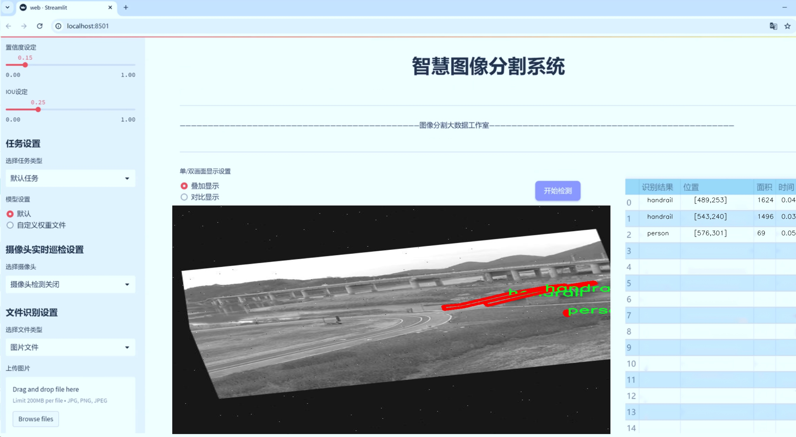
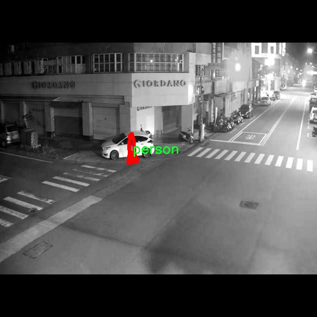

# 道路护栏图像分割系统： yolov8-seg-aux

### 1.研究背景与意义

[参考博客](https://gitee.com/YOLOv8_YOLOv11_Segmentation_Studio/projects)

[博客来源](https://kdocs.cn/l/cszuIiCKVNis)

研究背景与意义

随着城市化进程的加快，城市交通安全问题日益凸显，尤其是道路护栏的设计与管理成为了保障行人和车辆安全的重要环节。道路护栏不仅在交通管理中起到分隔作用，还能有效降低交通事故的发生率。然而，传统的道路护栏监测与管理方法往往依赖人工巡查，效率低下且容易出现漏检现象。因此，如何利用先进的计算机视觉技术实现对道路护栏的自动化监测与管理，成为了一个亟待解决的研究课题。

近年来，深度学习技术的快速发展为图像分割任务提供了新的解决方案。其中，YOLO（You Only Look Once）系列模型因其高效的实时检测能力而受到广泛关注。YOLOv8作为该系列的最新版本，结合了更为先进的网络结构和训练策略，展现出更高的检测精度和速度。然而，针对特定场景的图像分割任务，YOLOv8仍存在一定的局限性，尤其是在复杂背景下的目标分割精度和鲁棒性方面。因此，基于改进YOLOv8的道路护栏图像分割系统的研究，具有重要的理论价值和实际意义。

本研究所使用的数据集包含9900张图像，涵盖了两类目标：道路护栏和行人。这一数据集的构建不仅为模型的训练提供了丰富的样本，还为后续的模型评估和性能对比奠定了基础。通过对道路护栏和行人的精确分割，可以实现对交通场景的深度理解，从而为智能交通系统的建设提供数据支持。此外，数据集中行人与护栏的相互关系也为研究提供了丰富的语义信息，有助于提升模型对复杂场景的理解能力。

本研究的意义不仅在于提升道路护栏的自动化监测能力，更在于推动智能交通系统的发展。通过实现高效、准确的道路护栏图像分割，可以为交通管理部门提供实时监测数据，及时发现和处理潜在的安全隐患。同时，研究成果也可以为相关领域的学术研究提供借鉴，推动计算机视觉技术在交通安全领域的应用与发展。

综上所述，基于改进YOLOv8的道路护栏图像分割系统的研究，旨在通过深度学习技术提升道路护栏的监测效率与准确性，进而为城市交通安全管理提供有力支持。这一研究不仅具有重要的理论意义，也在实际应用中展现出广阔的前景，能够为构建更加安全、高效的智能交通系统贡献力量。

### 2.图片演示




注意：本项目提供完整的训练源码数据集和训练教程,由于此博客编辑较早,暂不提供权重文件（best.pt）,需要按照6.训练教程进行训练后实现上图效果。

### 3.视频演示

[3.1 视频演示](https://www.bilibili.com/video/BV1mum9YpEgx/)

### 4.数据集信息

##### 4.1 数据集类别数＆类别名

nc: 2
names: ['handrail', 'person']


##### 4.2 数据集信息简介

数据集信息展示

在本研究中，我们采用了名为“person_handrail_segmentation”的数据集，以训练和改进YOLOv8-seg模型，旨在实现高效的道路护栏图像分割系统。该数据集专注于两大类目标：护栏（handrail）和行人（person），为模型提供了丰富的标注数据，以便在复杂的交通环境中进行准确的物体识别和分割。

数据集的构建过程经过精心设计，确保了图像的多样性和代表性。每一幅图像都经过严格的标注，确保了护栏和行人的边界清晰可辨。这样的标注不仅包括了目标的形状和位置，还考虑了不同光照条件、天气变化以及不同角度下的视觉效果，从而使得模型在实际应用中能够更好地适应各种环境。

在数据集的图像内容方面，涵盖了城市街道、乡村道路、公共场所等多种场景，充分反映了护栏和行人在不同背景下的表现。这种多样性使得模型在训练过程中能够学习到更加丰富的特征，从而提高其在实际应用中的泛化能力。例如，在城市环境中，护栏可能与建筑物、交通标志等其他物体相邻，而在乡村环境中，护栏则可能与自然景观相结合，这些复杂的背景都为模型的训练提供了挑战。

数据集的大小和样本数量也是影响模型性能的重要因素。我们确保“person_handrail_segmentation”数据集包含了足够数量的图像样本，以便于模型在训练过程中能够进行有效的学习和调整。每个类别的样本数量经过合理分配，确保了模型在面对不同类别时的平衡性，避免了因类别不均而导致的偏差问题。

在数据预处理阶段，我们对图像进行了标准化处理，包括尺寸调整、数据增强等，以提高模型的鲁棒性。数据增强技术如随机裁剪、旋转、翻转和颜色变换等，使得模型能够在训练过程中接触到更多的变体，从而提升其在真实场景中的表现。

通过使用“person_handrail_segmentation”数据集，我们的目标是提升YOLOv8-seg模型在道路护栏图像分割任务中的性能。该数据集不仅为模型提供了丰富的训练素材，还为后续的模型评估和优化奠定了基础。我们相信，通过对该数据集的深入分析和应用，能够有效提升道路安全监测系统的智能化水平，为交通管理和行人安全提供更为可靠的技术支持。

总之，“person_handrail_segmentation”数据集的构建和应用为道路护栏图像分割系统的研究提供了坚实的基础。通过对护栏和行人这两个类别的深入分析与研究，我们期望能够推动智能交通系统的发展，提升城市交通管理的效率与安全性。





### 5.项目依赖环境部署教程（零基础手把手教学）

[5.1 环境部署教程链接（零基础手把手教学）](https://www.bilibili.com/video/BV1jG4Ve4E9t/?vd_source=bc9aec86d164b67a7004b996143742dc)


[5.2 安装Python虚拟环境创建和依赖库安装视频教程链接（零基础手把手教学）](https://www.bilibili.com/video/BV1nA4VeYEze/?vd_source=bc9aec86d164b67a7004b996143742dc)

### 6.手把手YOLOV8-seg训练视频教程（零基础手把手教学）

[6.1 手把手YOLOV8-seg训练视频教程（零基础小白有手就能学会）](https://www.bilibili.com/video/BV1cA4VeYETe/?vd_source=bc9aec86d164b67a7004b996143742dc)


按照上面的训练视频教程链接加载项目提供的数据集，运行train.py即可开始训练



     Epoch   gpu_mem       box       obj       cls    labels  img_size
     1/200     0G   0.01576   0.01955  0.007536        22      1280: 100%|██████████| 849/849 [14:42<00:00,  1.04s/it]
               Class     Images     Labels          P          R     mAP@.5 mAP@.5:.95: 100%|██████████| 213/213 [01:14<00:00,  2.87it/s]
                 all       3395      17314      0.994      0.957      0.0957      0.0843

     Epoch   gpu_mem       box       obj       cls    labels  img_size
     2/200     0G   0.01578   0.01923  0.007006        22      1280: 100%|██████████| 849/849 [14:44<00:00,  1.04s/it]
               Class     Images     Labels          P          R     mAP@.5 mAP@.5:.95: 100%|██████████| 213/213 [01:12<00:00,  2.95it/s]
                 all       3395      17314      0.996      0.956      0.0957      0.0845

     Epoch   gpu_mem       box       obj       cls    labels  img_size
     3/200     0G   0.01561    0.0191  0.006895        27      1280: 100%|██████████| 849/849 [10:56<00:00,  1.29it/s]
               Class     Images     Labels          P          R     mAP@.5 mAP@.5:.95: 100%|███████   | 187/213 [00:52<00:00,  4.04it/s]
                 all       3395      17314      0.996      0.957      0.0957      0.0845


### 7.50+种全套YOLOV8-seg创新点加载调参实验视频教程（一键加载写好的改进模型的配置文件）

[7.1 50+种全套YOLOV8-seg创新点加载调参实验视频教程（一键加载写好的改进模型的配置文件）](https://www.bilibili.com/video/BV1Hw4VePEXv/?vd_source=bc9aec86d164b67a7004b996143742dc)

### YOLOV8-seg算法简介

原始YOLOv8-seg算法原理

YOLOv8-seg算法是Ultralytics在2023年发布的最新目标检测模型，它在YOLO系列算法的基础上进行了多项创新和改进，尤其是在目标分割任务上表现出色。YOLOv8的设计理念源于前几代YOLO模型，如YOLOv3、YOLOv5、YOLOX等，吸收了这些模型的优点，尤其是在检测头的设计和损失函数的优化方面，YOLOv8-seg在性能上达到了新的高度。

首先，YOLOv8-seg在数据预处理阶段延续了YOLOv5的成功策略，采用了多种数据增强技术，如马赛克增强、混合增强、空间扰动和颜色扰动等。这些技术不仅丰富了训练数据的多样性，还提高了模型对不同场景和光照条件的适应能力。通过这些增强手段，YOLOv8-seg能够在训练过程中更好地学习到目标的特征，从而在实际应用中实现更高的检测精度。

在骨干网络结构方面，YOLOv8-seg引入了新的C2f模块，取代了YOLOv5中的C3模块。C2f模块通过增加更多的分支，增强了特征的表达能力，使得网络在进行特征提取时能够更好地捕捉到细节信息。这种结构的设计使得YOLOv8-seg在处理复杂场景时，能够更有效地提取目标特征，尤其是在目标与背景对比度较低的情况下。

YOLOv8-seg依然采用了FPN（特征金字塔网络）和PAN（路径聚合网络）结构，这一设计使得多尺度特征能够得到充分融合。FPN-PAN结构的核心在于通过不同层次的特征图进行信息的融合，从而提升模型对不同尺度目标的检测能力。YOLOv8-seg在这一结构上进行了优化，确保了特征信息在传递过程中的完整性和有效性，使得模型在面对多样化的目标时，依然能够保持高效的检测性能。

在检测头的设计上，YOLOv8-seg采用了解耦头的结构，这一创新使得分类和定位任务可以并行进行。通过分别提取类别特征和位置特征，YOLOv8-seg能够更精准地进行目标检测。这种解耦设计不仅提高了模型的检测精度，还减少了计算复杂度，使得YOLOv8-seg在实时检测场景中表现得更加出色。

标签分配策略是YOLOv8-seg的另一大亮点。与YOLOv5的候选框聚类策略不同，YOLOv8-seg采用了动态标签分配策略，具体实现为TOOD（Target-Oriented Object Detection）策略。这一策略通过动态调整正负样本的匹配，使得模型在训练过程中能够更好地适应数据集的特征，避免了因数据集不足而导致的标签不准确问题。YOLOv8-seg的损失函数设计也进行了创新，分类损失采用了VFL（Varifocal Loss），而回归损失则结合了CIoU（Complete Intersection over Union）和DFL（Distributive Focal Loss）。这种损失函数的设计使得模型在训练时能够更加关注高质量的正样本，同时有效降低负样本对整体损失的影响，从而提升了模型的整体性能。

YOLOv8-seg的网络结构分为三个主要部分：Backbone、Neck和Head。Backbone部分通过一系列卷积和反卷积层提取特征，使用残差连接和瓶颈结构来减小网络的大小并提高性能。Neck部分则负责多尺度特征的融合，以便更好地捕捉不同尺度目标的信息，提升目标检测的性能和鲁棒性。Head部分则是最终的目标检测和分类任务的执行者，设有多个检测头，能够在不同尺寸的信息下进行目标检测。

总的来说，YOLOv8-seg算法通过对数据预处理、骨干网络、特征融合、检测头设计和标签分配策略等多个方面的创新，显著提升了目标检测和分割的性能。其高精度和快速响应的特点，使得YOLOv8-seg在实际应用中展现出广泛的潜力，尤其是在需要实时检测的场景中，如自动驾驶、智能监控和机器人视觉等领域。通过将YOLOv8-seg应用于苹果采摘等具体任务，结合蚁群算法进行路径规划，进一步拓展了其在农业自动化中的应用前景，为实现智能化的农业生产提供了新的解决方案。


### 9.系统功能展示（检测对象为举例，实际内容以本项目数据集为准）

图9.1.系统支持检测结果表格显示

  图9.2.系统支持置信度和IOU阈值手动调节

  图9.3.系统支持自定义加载权重文件best.pt(需要你通过步骤5中训练获得)

  图9.4.系统支持摄像头实时识别

  图9.5.系统支持图片识别

  图9.6.系统支持视频识别

  图9.7.系统支持识别结果文件自动保存

  图9.8.系统支持Excel导出检测结果数据


### 10.50+种全套YOLOV8-seg创新点原理讲解（非科班也可以轻松写刊发刊，V11版本正在科研待更新）

#### 10.1 由于篇幅限制，每个创新点的具体原理讲解就不一一展开，具体见下列网址中的创新点对应子项目的技术原理博客网址【Blog】：


[10.1 50+种全套YOLOV8-seg创新点原理讲解链接](https://gitee.com/qunmasj/good)

#### 10.2 部分改进模块原理讲解(完整的改进原理见上图和技术博客链接)【如果此小节的图加载失败可以通过CSDN或者Github搜索该博客的标题访问原始博客，原始博客图片显示正常】
### YOLOv8简介
#### Neck模块设计
骨干网络和 Neck 的具体变化为：

第一个卷积层的 kernel 从 6x6 变成了 3x3
所有的 C3 模块换成 C2f，结构如下所示，可以发现多了更多的跳层连接和额外的 Split 操作


去掉了 Neck 模块中的 2 个卷积连接层
Backbone 中 C2f 的 block 数从 3-6-9-3 改成了 3-6-6-3
查看 N/S/M/L/X 等不同大小模型，可以发现 N/S 和 L/X 两组模型只是改了缩放系数，但是 S/M/L 等骨干网络的通道数设置不一样，没有遵循同一套缩放系数。如此设计的原因应该是同一套缩放系数下的通道设置不是最优设计，YOLOv7 网络设计时也没有遵循一套缩放系数作用于所有模型。

#### Head模块设计
Head 部分变化最大，从原先的耦合头变成了解耦头，并且从 YOLOv5 的 Anchor-Based 变成了 Anchor-Free。其结构如下所示：


可以看出，不再有之前的 objectness 分支，只有解耦的分类和回归分支，并且其回归分支使用了 Distribution Focal Loss 中提出的积分形式表示法。

#### Loss 计算
Loss 计算过程包括 2 个部分： 正负样本分配策略和 Loss 计算。 现代目标检测器大部分都会在正负样本分配策略上面做文章，典型的如 YOLOX 的 simOTA、TOOD 的 TaskAlignedAssigner 和 RTMDet 的 DynamicSoftLabelAssigner，这类 Assigner 大都是动态分配策略，而 YOLOv5 采用的依然是静态分配策略。考虑到动态分配策略的优异性，YOLOv8 算法中则直接引用了 TOOD 的 TaskAlignedAssigner。 TaskAlignedAssigner 的匹配策略简单总结为： 根据分类与回归的分数加权的分数选择正样本。

s 是标注类别对应的预测分值，u 是预测框和 gt 框的 iou，两者相乘就可以衡量对齐程度。

对于每一个 GT，对所有的预测框基于 GT 类别对应分类分数，预测框与 GT 的 IoU 的加权得到一个关联分类以及回归的对齐分数 alignment_metrics 。
对于每一个 GT，直接基于 alignment_metrics 对齐分数选取 topK 大的作为正样本
Loss 计算包括 2 个分支： 分类和回归分支，没有了之前的 objectness 分支。
分类分支依然采用 BCE Loss
回归分支需要和 Distribution Focal Loss 中提出的积分形式表示法绑定，因此使用了 Distribution Focal Loss， 同时还使用了 CIoU Loss
Loss 采用一定权重比例加权即可。
#### 训练数据增强
数据增强方面和 YOLOv5 差距不大，只不过引入了 YOLOX 中提出的最后 10 个 epoch 关闭 Mosaic 的操作。假设训练 epoch 是 500，其示意图如下所示：

### RCS-OSA的基本原理
参考该博客，RCSOSA（RCS-One-Shot Aggregation）是RCS-YOLO中提出的一种结构，我们可以将主要原理概括如下：

1. RCS（Reparameterized Convolution based on channel Shuffle）: 结合了通道混洗，通过重参数化卷积来增强网络的特征提取能力。

2. RCS模块: 在训练阶段，利用多分支结构学习丰富的特征表示；在推理阶段，通过结构化重参数化简化为单一分支，减少内存消耗。

3. OSA（One-Shot Aggregation）: 一次性聚合多个特征级联，减少网络计算负担，提高计算效率。

4. 特征级联: RCS-OSA模块通过堆叠RCS，确保特征的复用并加强不同层之间的信息流动。

#### RCS
RCS（基于通道Shuffle的重参数化卷积）是RCS-YOLO的核心组成部分，旨在训练阶段通过多分支结构学习丰富的特征信息，并在推理阶段通过简化为单分支结构来减少内存消耗，实现快速推理。此外，RCS利用通道分割和通道Shuffle操作来降低计算复杂性，同时保持通道间的信息交换，这样在推理阶段相比普通的3×3卷积可以减少一半的计算复杂度。通过结构重参数化，RCS能够在训练阶段从输入特征中学习深层表示，并在推理阶段实现快速推理，同时减少内存消耗。

#### RCS模块
RCS（基于通道Shuffle的重参数化卷积）模块中，结构在训练阶段使用多个分支，包括1x1和3x3的卷积，以及一个直接的连接（Identity），用于学习丰富的特征表示。在推理阶段，结构被重参数化成一个单一的3x3卷积，以减少计算复杂性和内存消耗，同时保持训练阶段学到的特征表达能力。这与RCS的设计理念紧密相连，即在不牺牲性能的情况下提高计算效率。


上图为大家展示了RCS的结构，分为训练阶段（a部分）和推理阶段（b部分）。在训练阶段，输入通过通道分割，一部分输入经过RepVGG块，另一部分保持不变。然后通过1x1卷积和3x3卷积处理RepVGG块的输出，与另一部分输入进行通道Shuffle和连接。在推理阶段，原来的多分支结构被简化为一个单一的3x3 RepConv块。这种设计允许在训练时学习复杂特征，在推理时减少计算复杂度。黑色边框的矩形代表特定的模块操作，渐变色的矩形代表张量的特定特征，矩形的宽度代表张量的通道数。 

#### OSA
OSA（One-Shot Aggregation）是一个关键的模块，旨在提高网络在处理密集连接时的效率。OSA模块通过表示具有多个感受野的多样化特征，并在最后的特征映射中仅聚合一次所有特征，从而克服了DenseNet中密集连接的低效率问题。

OSA模块的使用有两个主要目的：

1. 提高特征表示的多样性：OSA通过聚合具有不同感受野的特征来增加网络对于不同尺度的敏感性，这有助于提升模型对不同大小目标的检测能力。

2. 提高效率：通过在网络的最后一部分只进行一次特征聚合，OSA减少了重复的特征计算和存储需求，从而提高了网络的计算和能源效率。

在RCS-YOLO中，OSA模块被进一步与RCS（基于通道Shuffle的重参数化卷积）相结合，形成RCS-OSA模块。这种结合不仅保持了低成本的内存消耗，而且还实现了语义信息的有效提取，对于构建轻量级和大规模的对象检测器尤为重要。

下面我将为大家展示RCS-OSA（One-Shot Aggregation of RCS）的结构。


在RCS-OSA模块中，输入被分为两部分，一部分直接通过，另一部分通过堆叠的RCS模块进行处理。处理后的特征和直接通过的特征在通道混洗（Channel Shuffle）后合并。这种结构设计用于增强模型的特征提取和利用效率，是RCS-YOLO架构中的一个关键组成部分旨在通过一次性聚合来提高模型处理特征的能力，同时保持计算效率。

#### 特征级联
特征级联（feature cascade）是一种技术，通过在网络的一次性聚合（one-shot aggregate）路径上维持有限数量的特征级联来实现的。在RCS-YOLO中，特别是在RCS-OSA（RCS-Based One-Shot Aggregation）模块中，只保留了三个特征级联。

特征级联的目的是为了减轻网络计算负担并降低内存占用。这种方法可以有效地聚合不同层次的特征，提高模型的语义信息提取能力，同时避免了过度复杂化网络结构所带来的低效率和高资源消耗。

下面为大家提供的图像展示的是RCS-YOLO的整体架构，其中包括RCS-OSA模块。RCS-OSA在模型中用于堆叠RCS模块，以确保特征的复用并加强不同层之间的信息流动。图中显示的多层RCS-OSA模块的排列和组合反映了它们如何一起工作以优化特征传递和提高检测性能。


总结：RCS-YOLO主要由RCS-OSA（蓝色模块）和RepVGG（橙色模块）构成。这里的n代表堆叠RCS模块的数量。n_cls代表检测到的对象中的类别数量。图中的IDetect是从YOLOv7中借鉴过来的，表示使用二维卷积神经网络的检测层。这个架构通过堆叠的RCS模块和RepVGG模块，以及两种类型的检测层，实现了对象检测的任务。 


### 11.项目核心源码讲解（再也不用担心看不懂代码逻辑）

#### 11.1 ultralytics\models\yolo\segment\train.py

以下是对给定代码的核心部分进行提炼和详细注释的结果：

```python
# 引入必要的库和模块
from copy import copy
from ultralytics.models import yolo
from ultralytics.nn.tasks import SegmentationModel
from ultralytics.utils import DEFAULT_CFG, RANK
from ultralytics.utils.plotting import plot_images, plot_results

class SegmentationTrainer(yolo.detect.DetectionTrainer):
    """
    SegmentationTrainer类，继承自DetectionTrainer类，用于基于分割模型的训练。
    
    示例用法：
        ```python
        from ultralytics.models.yolo.segment import SegmentationTrainer

        args = dict(model='yolov8n-seg.pt', data='coco8-seg.yaml', epochs=3)
        trainer = SegmentationTrainer(overrides=args)
        trainer.train()
        ```
    """

    def __init__(self, cfg=DEFAULT_CFG, overrides=None, _callbacks=None):
        """初始化SegmentationTrainer对象，接受配置和重写参数。"""
        if overrides is None:
            overrides = {}
        overrides['task'] = 'segment'  # 设置任务类型为分割
        super().__init__(cfg, overrides, _callbacks)  # 调用父类构造函数

    def get_model(self, cfg=None, weights=None, verbose=True):
        """返回初始化的SegmentationModel模型，使用指定的配置和权重。"""
        # 创建SegmentationModel实例，设置输入通道数为3（RGB图像），类别数为数据集中类别数
        model = SegmentationModel(cfg, ch=3, nc=self.data['nc'], verbose=verbose and RANK == -1)
        if weights:
            model.load(weights)  # 如果提供了权重，则加载权重

        return model  # 返回模型实例

    def get_validator(self):
        """返回SegmentationValidator实例，用于YOLO模型的验证。"""
        self.loss_names = 'box_loss', 'seg_loss', 'cls_loss', 'dfl_loss'  # 定义损失名称
        # 创建SegmentationValidator实例并返回
        return yolo.segment.SegmentationValidator(self.test_loader, save_dir=self.save_dir, args=copy(self.args))

    def plot_training_samples(self, batch, ni):
        """创建训练样本图像的绘图，包含标签和边框坐标。"""
        plot_images(batch['img'],  # 图像数据
                    batch['batch_idx'],  # 批次索引
                    batch['cls'].squeeze(-1),  # 类别标签
                    batch['bboxes'],  # 边框坐标
                    batch['masks'],  # 分割掩码
                    paths=batch['im_file'],  # 图像文件路径
                    fname=self.save_dir / f'train_batch{ni}.jpg',  # 保存路径
                    on_plot=self.on_plot)  # 绘图回调

    def plot_metrics(self):
        """绘制训练和验证指标的图表。"""
        plot_results(file=self.csv, segment=True, on_plot=self.on_plot)  # 保存结果图像
```

### 核心部分说明：
1. **类的定义**：`SegmentationTrainer` 继承自 `DetectionTrainer`，专门用于分割任务的训练。
2. **初始化方法**：设置任务类型为分割，并调用父类的初始化方法。
3. **模型获取**：`get_model` 方法用于创建和返回分割模型的实例，可以选择加载预训练权重。
4. **验证器获取**：`get_validator` 方法返回用于验证模型性能的实例，定义了损失名称。
5. **绘图方法**：`plot_training_samples` 和 `plot_metrics` 方法用于可视化训练样本和训练过程中的指标。

这个文件是Ultralytics YOLO框架中用于图像分割任务的训练模块，主要定义了一个名为`SegmentationTrainer`的类，该类继承自`DetectionTrainer`，用于训练基于YOLO的分割模型。

在文件的开头，导入了一些必要的模块和类，包括YOLO模型、分割模型、默认配置、并行处理的排名工具，以及用于绘图的工具。这些导入为后续的训练和可视化提供了支持。

`SegmentationTrainer`类的构造函数`__init__`接收配置参数、覆盖参数和回调函数。它首先检查覆盖参数是否为`None`，如果是，则初始化为空字典。接着，它将任务类型设置为“segment”，并调用父类的构造函数进行初始化。这一过程确保了分割训练器的基本设置和父类的功能得以继承。

`get_model`方法用于返回一个初始化好的分割模型。它接收配置和权重参数，如果提供了权重，则会加载这些权重。该方法创建了一个`SegmentationModel`实例，并根据传入的配置和数据集类别数进行初始化。这里的`verbose`参数用于控制是否输出详细信息。

`get_validator`方法返回一个用于验证YOLO模型的验证器实例。它设置了损失名称，包括框损失、分割损失、分类损失和DFL损失，并创建了一个`SegmentationValidator`对象，负责在测试数据上进行模型验证。

`plot_training_samples`方法用于生成训练样本的可视化图像。它接收一个批次的图像数据和批次索引，利用`plot_images`函数绘制图像、类别、边界框和掩码，并将结果保存为图像文件。

最后，`plot_metrics`方法用于绘制训练和验证过程中的指标。它调用`plot_results`函数，将训练过程中的结果保存为PNG文件，便于后续分析和可视化。

整体来看，这个文件的主要功能是定义一个用于图像分割任务的训练器，提供模型初始化、验证、可视化等功能，方便用户进行YOLO分割模型的训练和评估。

#### 11.2 ultralytics\nn\extra_modules\ops_dcnv3\setup.py

以下是代码中最核心的部分，并附上详细的中文注释：

```python
import os
import glob
import torch
from torch.utils.cpp_extension import CUDA_HOME, CppExtension, CUDAExtension
from setuptools import find_packages, setup

# 定义所需的依赖包
requirements = ["torch", "torchvision"]

def get_extensions():
    # 获取当前文件的目录
    this_dir = os.path.dirname(os.path.abspath(__file__))
    # 定义扩展模块的源代码目录
    extensions_dir = os.path.join(this_dir, "src")

    # 查找主文件和CPU、CUDA源文件
    main_file = glob.glob(os.path.join(extensions_dir, "*.cpp"))
    source_cpu = glob.glob(os.path.join(extensions_dir, "cpu", "*.cpp"))
    source_cuda = glob.glob(os.path.join(extensions_dir, "cuda", "*.cu"))

    # 将主文件和CPU源文件合并
    sources = main_file + source_cpu
    extension = CppExtension  # 默认使用 CppExtension
    extra_compile_args = {"cxx": []}  # 编译参数
    define_macros = []  # 宏定义

    # 检查CUDA是否可用
    if torch.cuda.is_available() and CUDA_HOME is not None:
        extension = CUDAExtension  # 使用 CUDAExtension
        sources += source_cuda  # 添加CUDA源文件
        define_macros += [("WITH_CUDA", None)]  # 定义宏
        extra_compile_args["nvcc"] = []  # CUDA编译参数
    else:
        raise NotImplementedError('Cuda is not available')  # 如果CUDA不可用，抛出异常

    # 将源文件路径转换为绝对路径
    sources = [os.path.join(extensions_dir, s) for s in sources]
    include_dirs = [extensions_dir]  # 包含目录

    # 创建扩展模块
    ext_modules = [
        extension(
            "DCNv3",  # 扩展模块名称
            sources,  # 源文件列表
            include_dirs=include_dirs,  # 包含目录
            define_macros=define_macros,  # 宏定义
            extra_compile_args=extra_compile_args,  # 编译参数
        )
    ]
    return ext_modules  # 返回扩展模块列表

# 使用setuptools进行包的设置
setup(
    name="DCNv3",  # 包名称
    version="1.1",  # 包版本
    author="InternImage",  # 作者
    url="https://github.com/OpenGVLab/InternImage",  # 项目网址
    description="PyTorch Wrapper for CUDA Functions of DCNv3",  # 包描述
    packages=find_packages(exclude=("configs", "tests")),  # 查找包，排除指定目录
    ext_modules=get_extensions(),  # 获取扩展模块
    cmdclass={"build_ext": torch.utils.cpp_extension.BuildExtension},  # 指定构建扩展的命令类
)
```

### 代码说明：
1. **导入模块**：导入必要的库，包括`os`、`glob`、`torch`以及`setuptools`中的相关功能。
2. **定义依赖**：列出所需的Python包。
3. **获取扩展函数**：`get_extensions`函数负责查找源文件并配置扩展模块。
   - 通过`glob`查找`.cpp`和`.cu`文件。
   - 根据CUDA的可用性选择合适的扩展类型（`CppExtension`或`CUDAExtension`）。
   - 返回配置好的扩展模块列表。
4. **设置包信息**：使用`setuptools.setup`配置包的名称、版本、作者、描述等信息，并指定扩展模块和构建命令。

这个程序文件是一个用于设置和编译DCNv3（Deformable Convolutional Networks v3）扩展模块的Python脚本，主要依赖于PyTorch的C++扩展功能。文件的开头包含版权信息和许可证声明，表明该代码由OpenGVLab开发，并遵循MIT许可证。

在代码中，首先导入了一些必要的模块，包括操作系统模块`os`、文件路径匹配模块`glob`、以及PyTorch相关的模块。接着，定义了一个`requirements`列表，列出了该模块所需的Python库，包括`torch`和`torchvision`。

`get_extensions`函数是文件的核心部分。它的作用是收集所有需要编译的源文件，并根据系统的CUDA支持情况选择合适的扩展类型。函数首先获取当前文件的目录，并构建源文件的路径。它使用`glob`模块查找主文件和CPU、CUDA相关的源文件。

接下来，函数判断CUDA是否可用。如果可用，则使用`CUDAExtension`，并将CUDA源文件添加到源列表中，同时定义一个宏`WITH_CUDA`。如果CUDA不可用，则抛出一个`NotImplementedError`，表示该功能不支持。

在收集完所有源文件后，函数创建一个扩展模块列表`ext_modules`，其中包含了DCNv3的扩展信息，包括模块名称、源文件、包含目录、宏定义和编译参数。

最后，使用`setuptools`的`setup`函数进行模块的设置。设置包括模块名称、版本、作者信息、项目网址、描述、需要排除的包（如`configs`和`tests`），以及通过`get_extensions`函数获取的扩展模块。`cmdclass`参数指定了构建扩展时使用的命令类。

总的来说，这个文件的主要功能是配置和编译DCNv3的CUDA扩展，使其能够在PyTorch中使用，从而实现更高效的计算。

#### 11.3 ultralytics\utils\benchmarks.py

以下是经过简化和注释的核心代码部分，主要包括 `benchmark` 函数和 `ProfileModels` 类。注释详细解释了每个部分的功能和作用。

```python
import glob
import time
from pathlib import Path
import numpy as np
import torch.cuda
from ultralytics import YOLO
from ultralytics.utils import LOGGER, TQDM, WEIGHTS_DIR
from ultralytics.utils.checks import check_requirements
from ultralytics.utils.torch_utils import select_device

def benchmark(model=WEIGHTS_DIR / 'yolov8n.pt', imgsz=160, device='cpu', verbose=False):
    """
    对YOLO模型进行基准测试，评估不同格式的速度和准确性。

    参数:
        model (str | Path): 模型文件的路径，默认为 'yolov8n.pt'。
        imgsz (int): 测试时使用的图像大小，默认为160。
        device (str): 运行基准测试的设备，默认为 'cpu'。
        verbose (bool): 如果为True，则在基准测试失败时抛出异常，默认为False。

    返回:
        df (pandas.DataFrame): 包含每种格式的基准测试结果的数据框。
    """
    import pandas as pd
    pd.options.display.max_columns = 10
    pd.options.display.width = 120
    device = select_device(device, verbose=False)  # 选择设备
    model = YOLO(model)  # 加载YOLO模型

    results = []  # 存储结果
    start_time = time.time()  # 记录开始时间

    # 遍历导出格式
    for i, (name, format, suffix, cpu, gpu) in export_formats().iterrows():
        emoji, filename = '❌', None  # 默认导出状态为失败
        try:
            # 检查设备支持情况
            if 'cpu' in device.type:
                assert cpu, 'CPU不支持此推理'
            if 'cuda' in device.type:
                assert gpu, 'GPU不支持此推理'

            # 导出模型
            if format == '-':
                filename = model.ckpt_path or model.cfg  # PyTorch格式
            else:
                filename = model.export(imgsz=imgsz, format=format, device=device, verbose=False)
                assert suffix in str(filename), '导出失败'
            emoji = '✅'  # 导出成功

            # 进行推理
            model.predict(ASSETS / 'bus.jpg', imgsz=imgsz, device=device)

            # 验证模型
            results_dict = model.val(data=TASK2DATA[model.task], batch=1, imgsz=imgsz, device=device)
            metric, speed = results_dict.results_dict['mAP'], results_dict.speed['inference']
            results.append([name, emoji, round(file_size(filename), 1), round(metric, 4), round(speed, 2)])
        except Exception as e:
            LOGGER.warning(f'基准测试失败: {name}: {e}')
            results.append([name, emoji, None, None, None])  # 记录失败结果

    # 打印结果
    df = pd.DataFrame(results, columns=['格式', '状态', '大小 (MB)', 'mAP', '推理时间 (ms/im)'])
    LOGGER.info(f'基准测试完成\n{df}\n')
    return df

class ProfileModels:
    """
    用于分析不同模型在ONNX和TensorRT上的性能。

    属性:
        paths (list): 要分析的模型路径列表。
        imgsz (int): 分析时使用的图像大小，默认为640。

    方法:
        profile(): 分析模型并打印结果。
    """

    def __init__(self, paths: list, imgsz=640, device=None):
        """
        初始化ProfileModels类。

        参数:
            paths (list): 要分析的模型路径列表。
            imgsz (int): 分析时使用的图像大小，默认为640。
            device (torch.device): 用于分析的设备，默认为自动选择。
        """
        self.paths = paths
        self.imgsz = imgsz
        self.device = device or torch.device(0 if torch.cuda.is_available() else 'cpu')

    def profile(self):
        """记录模型的基准测试结果并返回结果。"""
        files = self.get_files()  # 获取模型文件

        if not files:
            print('未找到匹配的模型文件。')
            return

        table_rows = []  # 存储表格行
        for file in files:
            model = YOLO(str(file))  # 加载模型
            model_info = model.info()  # 获取模型信息
            # 进行性能分析
            t_onnx = self.profile_onnx_model(str(file.with_suffix('.onnx')))
            table_rows.append(self.generate_table_row(file.stem, t_onnx, model_info))

        self.print_table(table_rows)  # 打印结果表格

    def get_files(self):
        """返回用户提供的所有相关模型文件的路径列表。"""
        files = []
        for path in self.paths:
            path = Path(path)
            if path.is_dir():
                files.extend(glob.glob(str(path / '*.onnx')))
            elif path.suffix in {'.onnx', '.pt'}:
                files.append(str(path))
        return [Path(file) for file in sorted(files)]

    def profile_onnx_model(self, onnx_file: str):
        """分析ONNX模型并返回运行时间的平均值和标准差。"""
        import onnxruntime as ort
        sess = ort.InferenceSession(onnx_file)  # 创建ONNX推理会话
        input_data = np.random.rand(1, 3, self.imgsz, self.imgsz).astype(np.float32)  # 随机输入数据

        # 进行多次推理以测量时间
        run_times = []
        for _ in range(10):  # 10次推理
            start_time = time.time()
            sess.run(None, {sess.get_inputs()[0].name: input_data})  # 执行推理
            run_times.append((time.time() - start_time) * 1000)  # 转换为毫秒

        return np.mean(run_times), np.std(run_times)  # 返回平均时间和标准差

    def generate_table_row(self, model_name, t_onnx, model_info):
        """生成包含模型性能和指标详细信息的表格行。"""
        return f'| {model_name:18s} | {self.imgsz} | {t_onnx[0]:.2f} ± {t_onnx[1]:.2f} ms |'

    def print_table(self, table_rows):
        """格式化并打印不同模型的比较表。"""
        header = '| 模型 | 图像大小 | ONNX速度 (ms) |'
        print(header)
        print('|---|---|---|')
        for row in table_rows:
            print(row)
```

### 代码核心部分说明：
1. **benchmark 函数**：用于对YOLO模型进行基准测试，评估不同格式的速度和准确性。它加载模型，导出不同格式，进行推理并记录结果。
2. **ProfileModels 类**：用于分析不同模型在ONNX和TensorRT上的性能。它加载模型，执行推理并生成性能报告。
3. **文件处理**：使用 `glob` 模块获取指定路径下的模型文件。
4. **性能分析**：通过多次推理来测量模型的平均推理时间和标准差，确保结果的可靠性。
5. **结果展示**：以表格形式打印模型的性能数据，便于比较不同模型的表现。

这个程序文件 `ultralytics/utils/benchmarks.py` 主要用于对 YOLO 模型进行基准测试，以评估其在不同格式下的速度和准确性。文件中包含了两个主要的功能：`benchmark` 函数和 `ProfileModels` 类。

首先，`benchmark` 函数的作用是对指定的 YOLO 模型进行基准测试。用户可以通过传入模型路径、数据集、图像大小、设备类型等参数来进行测试。函数会遍历不同的模型格式，如 PyTorch、ONNX、TensorRT 等，导出模型并进行推理。它会记录每种格式的模型的文件大小、性能指标（如 mAP）和推理时间，并将结果以 pandas DataFrame 的形式返回。用户可以通过设置 `verbose` 参数来控制是否输出详细的错误信息。

在 `benchmark` 函数内部，首先会选择设备（CPU 或 GPU），然后加载模型。接着，函数会遍历预定义的模型格式，尝试导出模型并进行推理。每次推理后，函数会验证模型的性能并记录结果。如果导出或推理失败，函数会捕获异常并记录错误信息。最后，函数会打印基准测试的结果，并将其写入日志文件。

其次，`ProfileModels` 类用于对多个模型进行性能分析。用户可以通过传入模型路径列表来初始化该类。该类会对每个模型进行基准测试，包括速度和计算量（FLOPs）。它支持 ONNX 和 TensorRT 格式的模型，并提供了一些参数来控制测试的细节，比如运行次数、图像大小等。

在 `ProfileModels` 类中，`profile` 方法会获取模型文件并对其进行分析。它会导出模型为 ONNX 格式，并在需要时导出为 TensorRT 格式。然后，它会分别对这两种格式的模型进行基准测试，记录每种格式的推理时间和标准差。最后，方法会打印出一个包含所有模型性能的表格。

此外，类中还包含了一些辅助方法，例如 `get_files` 用于获取模型文件，`get_onnx_model_info` 用于获取 ONNX 模型的信息，`profile_tensorrt_model` 和 `profile_onnx_model` 用于分别对 TensorRT 和 ONNX 模型进行性能分析。

总的来说，这个文件提供了一套完整的工具，用于评估和比较不同格式的 YOLO 模型在速度和准确性上的表现，适合于深度学习研究人员和工程师在模型优化和部署时使用。

#### 11.4 ultralytics\nn\modules\head.py

以下是经过简化和注释的核心代码部分，主要保留了YOLOv8检测头的实现。注释详细解释了每个部分的功能和作用。

```python
import torch
import torch.nn as nn
from .conv import Conv  # 导入卷积模块
from .utils import bias_init_with_prob, linear_init_  # 导入初始化工具

class Detect(nn.Module):
    """YOLOv8检测头，用于目标检测模型。"""
    
    def __init__(self, nc=80, ch=()):
        """初始化YOLOv8检测层，指定类别数和通道数。
        
        参数:
            nc (int): 类别数量，默认为80。
            ch (tuple): 输入通道数的元组。
        """
        super().__init__()
        self.nc = nc  # 类别数量
        self.nl = len(ch)  # 检测层的数量
        self.reg_max = 16  # DFL通道数
        self.no = nc + self.reg_max * 4  # 每个锚框的输出数量
        self.stride = torch.zeros(self.nl)  # 构建时计算的步幅
        
        # 定义卷积层
        c2, c3 = max((16, ch[0] // 4, self.reg_max * 4)), max(ch[0], min(self.nc, 100))
        self.cv2 = nn.ModuleList(
            nn.Sequential(Conv(x, c2, 3), Conv(c2, c2, 3), nn.Conv2d(c2, 4 * self.reg_max, 1)) for x in ch)
        self.cv3 = nn.ModuleList(nn.Sequential(Conv(x, c3, 3), Conv(c3, c3, 3), nn.Conv2d(c3, self.nc, 1)) for x in ch)
        self.dfl = DFL(self.reg_max) if self.reg_max > 1 else nn.Identity()  # DFL层

    def forward(self, x):
        """前向传播，返回预测的边界框和类别概率。
        
        参数:
            x (list): 输入特征图的列表。
        
        返回:
            y (tensor): 包含边界框和类别概率的张量。
        """
        shape = x[0].shape  # 获取输入形状
        for i in range(self.nl):
            # 对每个检测层进行卷积操作并拼接
            x[i] = torch.cat((self.cv2[i](x[i]), self.cv3[i](x[i])), 1)
        
        # 训练模式下直接返回
        if self.training:
            return x
        
        # 动态锚框生成
        self.anchors, self.strides = (x.transpose(0, 1) for x in make_anchors(x, self.stride, 0.5))
        self.shape = shape
        
        # 拼接所有检测层的输出
        x_cat = torch.cat([xi.view(shape[0], self.no, -1) for xi in x], 2)
        
        # 分离边界框和类别概率
        box, cls = x_cat.split((self.reg_max * 4, self.nc), 1)
        dbox = dist2bbox(self.dfl(box), self.anchors.unsqueeze(0), xywh=True, dim=1) * self.strides
        
        # 返回最终的预测结果
        y = torch.cat((dbox, cls.sigmoid()), 1)  # 将边界框和类别概率拼接
        return y

    def bias_init(self):
        """初始化Detect()的偏置，要求有步幅可用。"""
        m = self  # 当前模型
        for a, b, s in zip(m.cv2, m.cv3, m.stride):  # 遍历卷积层
            a[-1].bias.data[:] = 1.0  # 边界框偏置初始化
            b[-1].bias.data[:m.nc] = math.log(5 / m.nc / (640 / s) ** 2)  # 类别偏置初始化
```

### 代码说明
1. **Detect类**: 这是YOLOv8的检测头，负责处理输入特征并生成目标检测的边界框和类别概率。
2. **初始化方法**: 
   - `nc`表示类别数量，`ch`表示输入通道数。
   - 使用卷积层构建两个子网络，分别用于生成边界框和类别预测。
3. **前向传播方法**:
   - 输入为特征图列表，经过卷积处理后拼接。
   - 计算锚框和步幅，生成最终的边界框和类别概率。
4. **偏置初始化**: 用于初始化模型的偏置，确保模型在训练开始时有良好的起始点。

通过这些注释，代码的功能和结构应该更加清晰。

这个程序文件是Ultralytics YOLO（You Only Look Once）模型的一个重要模块，主要负责模型的头部结构，包含了多个用于目标检测、分割、姿态估计和分类的类。文件中定义了多个类，包括`Detect`、`Segment`、`Pose`、`Classify`和`RTDETRDecoder`，每个类都有其特定的功能和结构。

首先，`Detect`类是YOLOv8检测头的实现，负责处理目标检测任务。它的构造函数初始化了类别数量、检测层数、输出通道等参数，并定义了卷积层用于特征提取。在前向传播方法中，它接收输入特征，经过一系列卷积操作后，生成边界框和类别概率。如果模型处于训练状态，它将返回原始输出；如果是推理状态，则会生成锚框并计算最终的边界框和类别概率。

`Segment`类继承自`Detect`，用于图像分割任务。它在初始化时增加了掩膜数量和原型数量的参数，并定义了额外的卷积层来处理掩膜系数。在前向传播中，它会计算掩膜原型，并在训练和推理阶段返回不同的输出。

`Pose`类同样继承自`Detect`，专注于关键点检测任务。它初始化时设置关键点的形状，并在前向传播中计算关键点的输出。关键点的解码过程将模型输出转换为实际的关键点坐标。

`Classify`类是YOLOv8的分类头，负责将输入的特征图转换为类别概率。它通过卷积层、池化层和全连接层进行处理，最终输出分类结果。

最后，`RTDETRDecoder`类实现了实时可变形Transformer解码器，结合了Transformer架构和可变形卷积，用于目标检测。它在初始化时设置了多个参数，包括类别数量、特征通道、隐藏层维度等。前向传播方法中，它处理输入特征，生成锚框，并通过解码器计算最终的边界框和分类分数。

整个文件通过定义这些类和方法，构建了YOLOv8模型的头部结构，使其能够处理不同的计算机视觉任务，如目标检测、图像分割、姿态估计和图像分类。每个类都实现了特定的功能，确保模型在不同任务中的有效性和灵活性。

#### 11.5 train.py

以下是经过简化和注释的核心代码部分：

```python
import os
import torch
import yaml
from ultralytics import YOLO  # 导入YOLO模型库

if __name__ == '__main__':  # 确保该模块被直接运行时才执行以下代码
    # 设置训练参数
    workers = 1  # 数据加载的工作进程数
    batch = 8  # 每个批次的样本数量
    device = "0" if torch.cuda.is_available() else "cpu"  # 检查是否有可用的GPU

    # 获取数据集配置文件的绝对路径
    data_path = abs_path(f'datasets/data/data.yaml', path_type='current')

    # 将路径格式转换为Unix风格
    unix_style_path = data_path.replace(os.sep, '/')
    # 获取数据集目录路径
    directory_path = os.path.dirname(unix_style_path)

    # 读取YAML配置文件
    with open(data_path, 'r') as file:
        data = yaml.load(file, Loader=yaml.FullLoader)

    # 修改数据集路径
    if 'train' in data and 'val' in data and 'test' in data:
        data['train'] = directory_path + '/train'  # 设置训练集路径
        data['val'] = directory_path + '/val'      # 设置验证集路径
        data['test'] = directory_path + '/test'    # 设置测试集路径

        # 将修改后的数据写回YAML文件
        with open(data_path, 'w') as file:
            yaml.safe_dump(data, file, sort_keys=False)

    # 加载YOLO模型
    model = YOLO(r"C:\codeseg\codenew\50+种YOLOv8算法改进源码大全和调试加载训练教程（非必要）\改进YOLOv8模型配置文件\yolov8-seg-C2f-Faster.yaml").load("./weights/yolov8s-seg.pt")

    # 开始训练模型
    results = model.train(
        data=data_path,  # 指定训练数据的配置文件路径
        device=device,  # 指定使用的设备（GPU或CPU）
        workers=workers,  # 指定数据加载的工作进程数
        imgsz=640,  # 输入图像的大小
        epochs=100,  # 训练的轮数
        batch=batch,  # 每个批次的样本数量
    )
```

### 代码详细注释说明：

1. **导入必要的库**：
   - `os`：用于处理文件和目录路径。
   - `torch`：PyTorch库，用于深度学习。
   - `yaml`：用于读取和写入YAML格式的配置文件。
   - `YOLO`：从`ultralytics`库中导入YOLO模型。

2. **主程序入口**：
   - 使用`if __name__ == '__main__':`确保代码仅在直接运行时执行。

3. **设置训练参数**：
   - `workers`：指定数据加载的工作进程数。
   - `batch`：设置每个批次的样本数量。
   - `device`：检查是否有可用的GPU，如果有则使用GPU，否则使用CPU。

4. **获取数据集配置文件的路径**：
   - 使用`abs_path`函数获取数据集配置文件的绝对路径，并将路径格式转换为Unix风格。

5. **读取和修改YAML配置文件**：
   - 读取YAML文件内容，并检查是否包含训练、验证和测试集的路径。
   - 如果存在，则更新这些路径为当前目录下的相应子目录，并将修改后的内容写回YAML文件。

6. **加载YOLO模型**：
   - 使用指定的配置文件和预训练权重加载YOLO模型。

7. **开始训练模型**：
   - 调用`model.train()`方法，传入训练数据的配置文件路径、设备、工作进程数、输入图像大小、训练轮数和批次大小等参数，开始模型训练。

该程序文件`train.py`的主要功能是使用YOLO（You Only Look Once）模型进行目标检测的训练。程序首先导入了必要的库，包括`os`、`torch`、`yaml`和`ultralytics`中的YOLO模型。接着，使用`matplotlib`库设置图形界面为`TkAgg`。

在`__main__`块中，程序首先定义了一些训练参数，包括工作进程数`workers`、批次大小`batch`和设备选择`device`。设备选择会根据当前是否有可用的GPU来决定，如果有则使用GPU（设备编号为"0"），否则使用CPU。

接下来，程序构建了数据集配置文件的绝对路径，并将路径格式转换为Unix风格。然后，程序读取指定的YAML文件，获取数据集的相关信息。在读取数据后，程序检查YAML文件中是否包含`train`、`val`和`test`字段，如果存在，则更新这些字段的路径为当前目录下的`train`、`val`和`test`子目录。修改完成后，程序将更新后的数据写回到YAML文件中。

在模型加载部分，程序使用YOLO模型的配置文件进行初始化，并加载预训练的权重文件。这里提到不同模型对设备的要求不同，如果遇到显存不足的错误，可以尝试使用其他模型配置文件。

最后，程序调用`model.train()`方法开始训练，传入了数据配置文件路径、设备、工作进程数、输入图像大小、训练轮数和批次大小等参数。训练将持续进行100个epoch，图像大小设置为640x640，批次大小为8。

总体而言，该程序文件是一个用于训练YOLO模型的脚本，包含了数据预处理、模型加载和训练过程的完整步骤。

### 12.系统整体结构（节选）

### 程序整体功能和构架概括

该程序是一个基于Ultralytics YOLO框架的目标检测和图像分割训练系统。它的整体架构包括多个模块，各自负责不同的功能，从模型的定义、训练、基准测试到特定操作的实现。主要模块包括：

1. **模型训练模块**：负责图像分割模型的训练，定义了训练过程中的各项参数和方法。
2. **扩展模块设置**：用于配置和编译DCNv3（可变形卷积网络）扩展，以提高模型的计算效率。
3. **基准测试工具**：用于评估不同模型格式的性能，包括速度和准确性，帮助用户选择最佳模型。
4. **模型头部模块**：定义了YOLO模型的不同头部结构，支持目标检测、分割、姿态估计和分类等任务。
5. **训练脚本**：整合上述模块，提供一个简单的接口来启动训练过程，处理数据集配置和模型加载。

### 文件功能整理表

| 文件路径                                           | 功能描述                                                         |
|--------------------------------------------------|------------------------------------------------------------------|
| `ultralytics/models/yolo/segment/train.py`      | 定义图像分割模型的训练器，处理模型初始化、验证和可视化等功能。  |
| `ultralytics/nn/extra_modules/ops_dcnv3/setup.py` | 配置和编译DCNv3扩展模块，以提高YOLO模型的计算效率。              |
| `ultralytics/utils/benchmarks.py`               | 提供基准测试工具，评估不同模型格式的速度和准确性。                |
| `ultralytics/nn/modules/head.py`                | 定义YOLO模型的头部结构，支持目标检测、分割、姿态估计和分类。      |
| `train.py`                                       | 启动YOLO模型的训练过程，处理数据集配置、模型加载和训练参数设置。 |

通过这些模块的协同工作，用户可以方便地进行YOLO模型的训练、评估和优化，以满足不同的计算机视觉任务需求。

### 13.图片、视频、摄像头图像分割Demo(去除WebUI)代码

在这个博客小节中，我们将讨论如何在不使用WebUI的情况下，实现图像分割模型的使用。本项目代码已经优化整合，方便用户将分割功能嵌入自己的项目中。
核心功能包括图片、视频、摄像头图像的分割，ROI区域的轮廓提取、类别分类、周长计算、面积计算、圆度计算以及颜色提取等。
这些功能提供了良好的二次开发基础。

### 核心代码解读

以下是主要代码片段，我们会为每一块代码进行详细的批注解释：

```python
import random
import cv2
import numpy as np
from PIL import ImageFont, ImageDraw, Image
from hashlib import md5
from model import Web_Detector
from chinese_name_list import Label_list

# 根据名称生成颜色
def generate_color_based_on_name(name):
    ......

# 计算多边形面积
def calculate_polygon_area(points):
    return cv2.contourArea(points.astype(np.float32))

...
# 绘制中文标签
def draw_with_chinese(image, text, position, font_size=20, color=(255, 0, 0)):
    image_pil = Image.fromarray(cv2.cvtColor(image, cv2.COLOR_BGR2RGB))
    draw = ImageDraw.Draw(image_pil)
    font = ImageFont.truetype("simsun.ttc", font_size, encoding="unic")
    draw.text(position, text, font=font, fill=color)
    return cv2.cvtColor(np.array(image_pil), cv2.COLOR_RGB2BGR)

# 动态调整参数
def adjust_parameter(image_size, base_size=1000):
    max_size = max(image_size)
    return max_size / base_size

# 绘制检测结果
def draw_detections(image, info, alpha=0.2):
    name, bbox, conf, cls_id, mask = info['class_name'], info['bbox'], info['score'], info['class_id'], info['mask']
    adjust_param = adjust_parameter(image.shape[:2])
    spacing = int(20 * adjust_param)

    if mask is None:
        x1, y1, x2, y2 = bbox
        aim_frame_area = (x2 - x1) * (y2 - y1)
        cv2.rectangle(image, (x1, y1), (x2, y2), color=(0, 0, 255), thickness=int(3 * adjust_param))
        image = draw_with_chinese(image, name, (x1, y1 - int(30 * adjust_param)), font_size=int(35 * adjust_param))
        y_offset = int(50 * adjust_param)  # 类别名称上方绘制，其下方留出空间
    else:
        mask_points = np.concatenate(mask)
        aim_frame_area = calculate_polygon_area(mask_points)
        mask_color = generate_color_based_on_name(name)
        try:
            overlay = image.copy()
            cv2.fillPoly(overlay, [mask_points.astype(np.int32)], mask_color)
            image = cv2.addWeighted(overlay, 0.3, image, 0.7, 0)
            cv2.drawContours(image, [mask_points.astype(np.int32)], -1, (0, 0, 255), thickness=int(8 * adjust_param))

            # 计算面积、周长、圆度
            area = cv2.contourArea(mask_points.astype(np.int32))
            perimeter = cv2.arcLength(mask_points.astype(np.int32), True)
            ......

            # 计算色彩
            mask = np.zeros(image.shape[:2], dtype=np.uint8)
            cv2.drawContours(mask, [mask_points.astype(np.int32)], -1, 255, -1)
            color_points = cv2.findNonZero(mask)
            ......

            # 绘制类别名称
            x, y = np.min(mask_points, axis=0).astype(int)
            image = draw_with_chinese(image, name, (x, y - int(30 * adjust_param)), font_size=int(35 * adjust_param))
            y_offset = int(50 * adjust_param)

            # 绘制面积、周长、圆度和色彩值
            metrics = [("Area", area), ("Perimeter", perimeter), ("Circularity", circularity), ("Color", color_str)]
            for idx, (metric_name, metric_value) in enumerate(metrics):
                ......

    return image, aim_frame_area

# 处理每帧图像
def process_frame(model, image):
    pre_img = model.preprocess(image)
    pred = model.predict(pre_img)
    det = pred[0] if det is not None and len(det)
    if det:
        det_info = model.postprocess(pred)
        for info in det_info:
            image, _ = draw_detections(image, info)
    return image

if __name__ == "__main__":
    cls_name = Label_list
    model = Web_Detector()
    model.load_model("./weights/yolov8s-seg.pt")

    # 摄像头实时处理
    cap = cv2.VideoCapture(0)
    while cap.isOpened():
        ret, frame = cap.read()
        if not ret:
            break
        ......

    # 图片处理
    image_path = './icon/OIP.jpg'
    image = cv2.imread(image_path)
    if image is not None:
        processed_image = process_frame(model, image)
        ......

    # 视频处理
    video_path = ''  # 输入视频的路径
    cap = cv2.VideoCapture(video_path)
    while cap.isOpened():
        ret, frame = cap.read()
        ......
```


### 14.完整训练+Web前端界面+50+种创新点源码、数据集获取


# [下载链接：https://mbd.pub/o/bread/Z5aUm59w](https://mbd.pub/o/bread/Z5aUm59w)